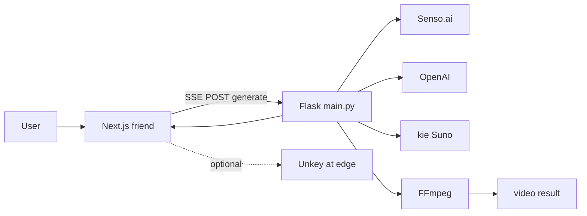

# ReelForge implementation plan

## Team split

| Owner      | Scope                                                                                                                                                                                                                                                                                                  |
| ---------- | ------------------------------------------------------------------------------------------------------------------------------------------------------------------------------------------------------------------------------------------------------------------------------------------------------ |
| **You**    | Backend core: `main.py` (**Flask**), Railtracks pipeline, Senso / OpenAI / kie / DALL-E integrations, FFmpeg assembly, streaming progress events, **serve with uvicorn** (no Docker for now), API contract doc for the frontend. i created folder called core, just use core folder as backend i guess |
| **Friend** | Next.js UI: `assistant-ui`, topic input, consuming your stream (SSE or NDJSON), optional Next.js route that proxies to your backend + **Unkey** on the public edge if that fits their setup.                                                                                                           |

The [rules/coding-style.md](rules/coding-style.md) *"one main.py"* rule applies to **your** Python service; the frontend lives in a separate app (your repo may only contain `api/` or root `main.py` + `requirements` + `Dockerfile`).

## Target architecture

## Backend contract (for your friend)

Define and stick to one pattern so UI work is parallel:

- **Endpoint:** e.g. `POST /generate` with JSON `{ "topic": "string" }`.
- **Response:** **SSE** (`text/event-stream`) with named events, e.g. `research`, `script`, `music`, `visuals`, `render`, `done`, `error` — each payload JSON with step-specific fields (context snippet, lines array, audio URL optional, image URLs, final `video_url` or relative path).
- **CORS:** If the Next app is on another origin in dev/prod, enable CORS on Flask (`flask-cors` or manual `Access-Control-`* on the app) for the friend’s origins.
- **Auth:** Either friend forwards `Authorization: Bearer <unkey>` and you validate with Unkey SDK, or friend validates only at Next and calls your service on a private network / shared secret—pick one and document it.

## FFmpeg / “beat-synced” reality check

1. Download images + audio to temp (`/tmp` on DO).
2. Slideshow: concat or xfade; **duration per image** = `audio_duration / n_lines` (or fixed cap) to match track length.
3. Captions: SRT/ASS or timed `drawtext` per segment—not a single static string.
4. Runtime: **ffmpeg binary** must exist in the container/image (`ffmpeg-python` is a wrapper).

## API integrations (backend)

| Service      | Backend action                                                                                 |
| ------------ | ---------------------------------------------------------------------------------------------- |
| **Senso.ai** | `senso_search(topic) -> str` for script context                                                |
| **OpenAI**   | `OPENAI_API_KEY`: chat for script + DALL-E 3 per line                                          |
| **kie Suno** | Poll until MP3 URL; use duration for FFmpeg                                                    |
| **Unkey**    | Validate on Flask **or** only on Next—avoid double confusion; one place is enough for the demo |

## Sprint mapping (rebalanced)

**You (backend)**

- Flask + Railtracks nodes end-to-end; structured streaming events (SSE via `Response` + stream generator or chunked).
- FFmpeg 9:16 output; expose final asset (signed URL, static mount, or base64 for tiny demos—keep clips short).
- Dockerfile + DO for Python + ffmpeg; env template (`OPENAI_API_KEY`, Senso, kie keys, etc.).

**Friend (frontend)**

- Next.js + assistant-ui wired to your `POST /generate` stream.
- Optional: Next `/api/generate` proxy + Unkey middleware.

**Together**

- Integration test: topic → streamed steps → playable MP4 in UI.

## Repo layout (suggested)

- **Your repo / folder:** `main.py` (or `api/main.py`), `requirements.txt` or `pyproject.toml`, `Dockerfile`, `.env.example`, short `API.md` for your friend.
- **Friend’s repo:** Next.js app; `NEXT_PUBLIC_REELFORGE_API_URL` or server-side `REELFORGE_BACKEND_URL`.

## Risks (3-hour window)

- **Railtracks:** Confirm package name and `agent_node` API from official docs/examples.
- **Timeouts:** Long-running pipeline → use a **long-lived** Python service on DO, not a 10s serverless function.
- **Senso/kie latency:** Streaming events keep the UI responsive.

## Optional

- Strict single-file *everything* including HTML would mean no Next.js—not your split; friend owns UI.

